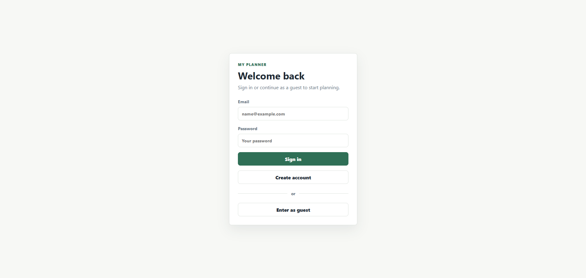
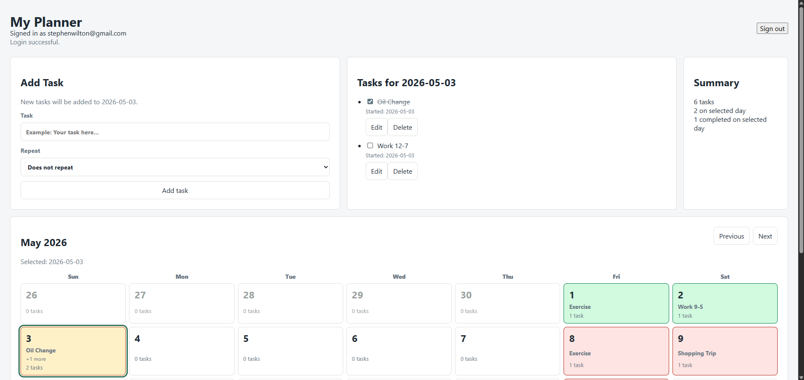

# My Planner

My Planner is a full-stack task planning app built with React, Node.js, and MySQL. It lets a user create an account, sign in, add tasks to calendar dates, mark tasks complete for specific days, and create recurring tasks.

This project was built as a learning-focused portfolio app to practice connecting a React frontend to a backend API and a SQL database.

## Screenshots





## Features

- Register and sign in with an email and password
- Continue as a guest without saving data
- Add, edit, delete, and complete tasks
- View tasks by selected calendar date
- Move between calendar months
- Add recurring tasks: daily, every other day, weekly, or monthly
- Save registered users and their tasks in MySQL
- Track completed recurring tasks per date

## Tech Stack

- React
- Vite
- Node.js
- MySQL
- mysql2
- dotenv

## What I Practiced

- Building React components with state and props
- Handling forms and user input
- Using fetch requests to communicate with a backend
- Creating REST-style API routes
- Reading and writing data with MySQL
- Hashing passwords before saving them
- Separating guest-only state from saved user data
- Modeling task completion by date for recurring tasks

## Getting Started

Install dependencies:

```bash
npm install
```

Create a MySQL database:

```sql
CREATE DATABASE my_planner;
```

Copy `.env.example` to `.env`, then update the values for your local MySQL setup:

```text
DB_HOST=localhost
DB_PORT=3306
DB_USER=root
DB_PASSWORD=your_mysql_password
DB_NAME=my_planner
```

The server creates the `users` and `tasks` tables automatically when it starts. The table structure is also available in `server/schema.sql`.

## Running the App

Use two terminals.

Start the backend:

```bash
npm run server
```

Start the frontend:

```bash
npm run dev
```

Then open the local Vite URL shown in the terminal, usually:

```text
http://localhost:5173
```

## Notes

This is a portfolio and learning project, not a production authentication system. Passwords are hashed before being stored, but the app does not currently include sessions, JWTs, password reset, email verification, or deployment configuration.
